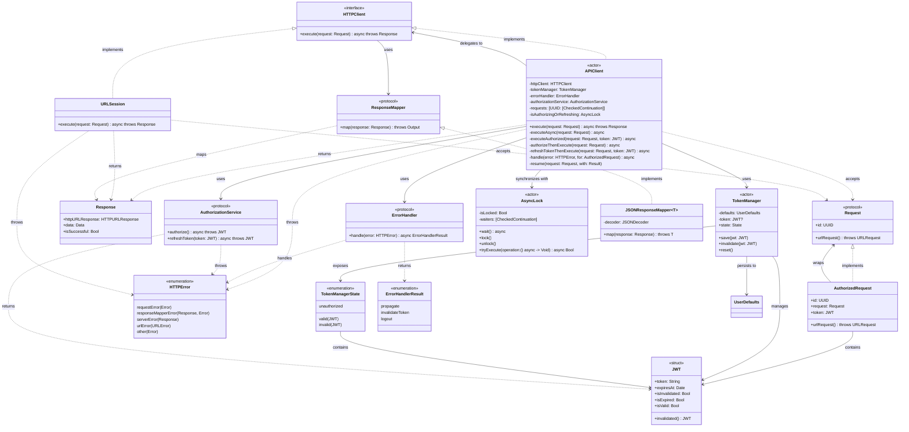

# HTTP Package Class Diagram

This diagram shows the relationships between core components in the HTTP package.

## Class Diagram

## Component Responsibilities

### Core Actors

#### APIClient
- **Main coordinator** for all HTTP operations
- Manages request deduplication via UUID-based queue
- Orchestrates token lifecycle (authorize/refresh/invalidate)
- Delegates error handling strategies
- Thread-safe via Swift Actor isolation

#### TokenManager
- **Token storage and state management**
- Persists JWT to UserDefaults
- Exposes token state (valid/invalid/unauthorized)
- Thread-safe via Swift Actor isolation

#### AsyncLock
- **Synchronization primitive** for authorize/refresh operations
- Ensures only one authorization operation at a time
- Provides barrier pattern for async operations

### Protocols

#### HTTPClient
- **Abstraction** for HTTP execution
- Implemented by both `APIClient` and `URLSession`
- Allows for testing and composition

#### Request
- **Defines API requests** with deduplication support
- `id` property controls deduplication behavior
- Implementations provide URLRequest construction

#### ErrorHandler
- **Strategy pattern** for error responses
- Application-specific error handling logic
- Returns action to take (propagate/invalidate/logout)

#### AuthorizationService
- **Authentication operations**
- Initial authorization and token refresh
- Application-specific auth logic

#### ResponseMapper
- **Response transformation**
- Maps raw Response to domain types
- Generic over output type

### Data Types

#### Response
- **HTTP response wrapper**
- Contains HTTPURLResponse and raw data
- Provides success checking

#### JWT
- **JSON Web Token representation**
- Parses expiration from token payload
- Tracks invalidation state
- Immutable struct (Sendable)

#### HTTPError
- **Typed error enumeration**
- Categorizes different failure modes
- Carries context (Response, underlying Error)

#### AuthorizedRequest
- **Request wrapper with authentication**
- Proxies original Request.id for deduplication
- Adds Bearer token to headers

## Key Relationships

### Composition
- `APIClient` **composes** HTTPClient, TokenManager, ErrorHandler, AuthorizationService
- Dependency injection enables testing and flexibility

### Delegation
- `APIClient` **delegates** actual HTTP execution to `httpClient`
- `APIClient` **delegates** error strategy decisions to `errorHandler`

### Coordination
- `APIClient` **coordinates** token lifecycle with `tokenManager`
- `APIClient` **synchronizes** auth operations via `asyncLock`

### Transformation
- `AuthorizedRequest` **wraps** Request and adds authentication
- `ResponseMapper` **transforms** Response to typed data

## Design Patterns

- **Actor Pattern** - APIClient, TokenManager, AsyncLock for thread-safety
- **Strategy Pattern** - ErrorHandler for configurable error handling
- **Proxy Pattern** - AuthorizedRequest proxies Request.id
- **Dependency Injection** - All dependencies injected in APIClient init
- **Protocol-Oriented** - Heavy use of protocols for abstraction and testing