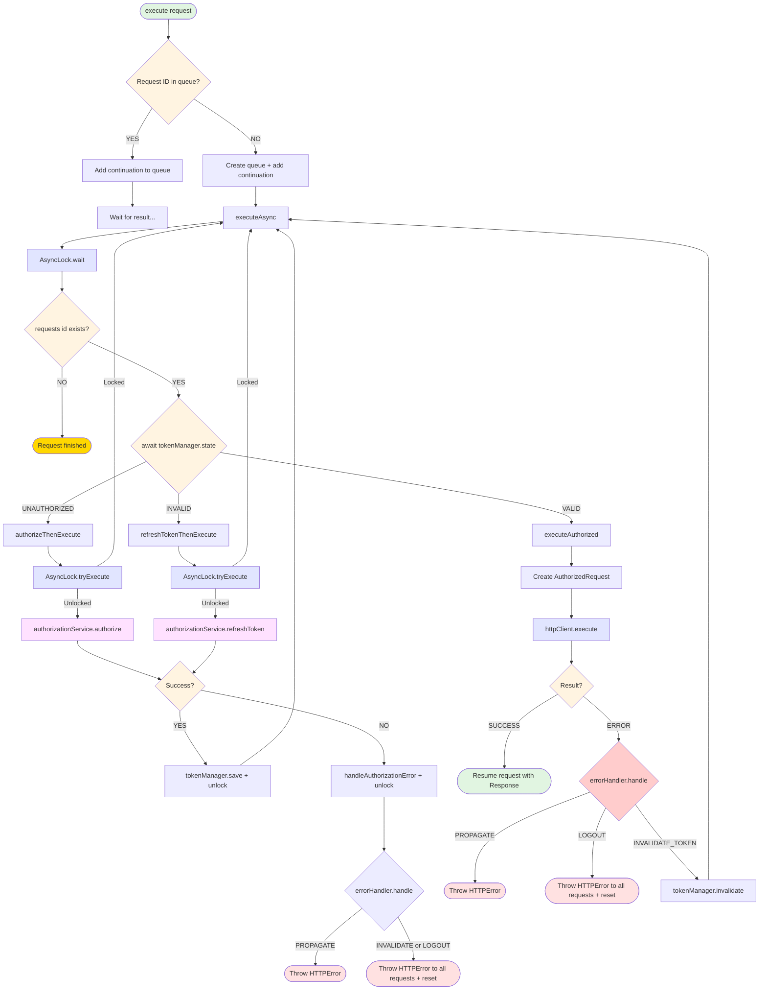

# APIClient Request Flow Diagram

This diagram illustrates the complete request execution flow in the HTTP package, including:
- Request deduplication
- AsyncLock synchronization for authorize/refresh operations
- Token state management
- Error handling strategies
- Retry mechanisms

## Flow Diagram



## Legend

- 🟢 **Green** - Success paths
- 🔴 **Red** - Error/failure endpoints
- 🟡 **Yellow** - Cancellation/completion
- 🔵 **Blue** - Synchronization operations (AsyncLock)
- 🟣 **Purple** - External service calls (AuthorizationService)
- 🟠 **Orange** - Decision points

## Key Flow Points

### 1. Request Deduplication
Multiple requests with the same ID share a single execution. Additional requests wait for the first to complete.

### 2. AsyncLock Protection
`AsyncLock.wait()` ensures only one authorize/refresh operation executes at a time. Other requests wait at the barrier.

### 3. Token State Check
After waiting, each request independently checks token state, which may have changed during the wait.

### 4. Sequential Retry
If authorize/refresh fails, subsequent requests retry sequentially (not in parallel). This design handles transient network errors.

### 5. Guard Checks
Before critical operations, the code checks if `requests[id]` still exists, preventing crashes from already-completed requests.

### 6. Error Strategies
- **PROPAGATE** - Return error to specific request
- **INVALIDATE_TOKEN** - Invalidate token and retry request
- **LOGOUT** - Fail all pending requests and reset tokens

## Example Scenarios

### Scenario 1: Multiple Unauthorized Requests
```
Request A, B, C arrive (all unauthorized)
→ All wait at AsyncLock
→ Request A wins tryExecute, calls authorize()
→ B and C wait
→ A completes, saves token, unlocks
→ B wakes up, sees valid token, executes
→ C wakes up, sees valid token, executes
```

### Scenario 2: 401 Error with Token Refresh
```
Request executes with valid token
→ Server returns 401
→ errorHandler returns INVALIDATE_TOKEN
→ tokenManager.invalidate()
→ executeAsync again
→ Token now invalid, triggers refresh
→ After refresh, retry with new token
```

### Scenario 3: Deduplication
```
Request A starts (ID: 123)
Request B arrives (ID: 123) - same ID!
→ B's continuation added to queue
→ Only one HTTP call executes
→ Both A and B receive same response
```